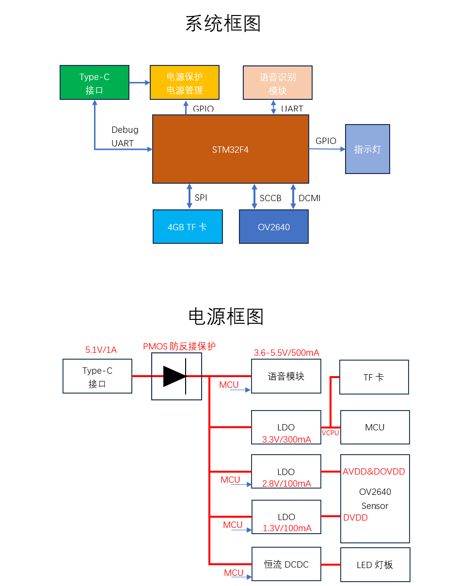
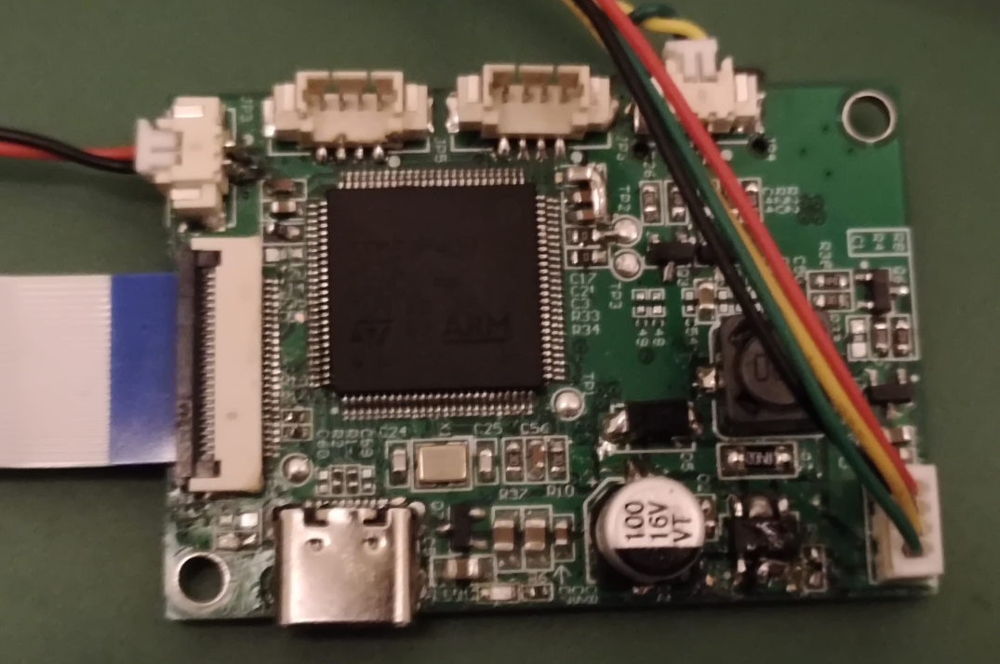
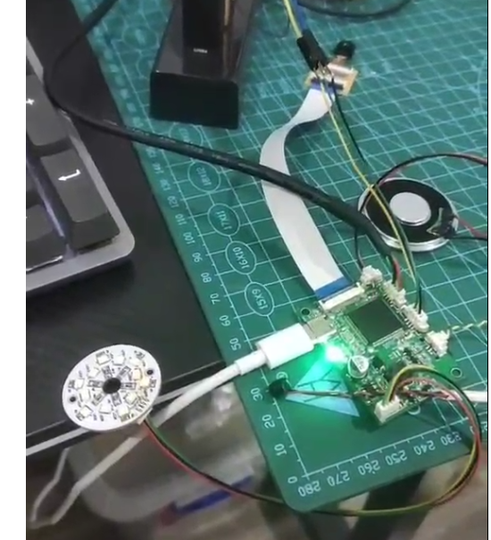

# 语音拍照存储系统

[TOC]

## 简介

- 基于STM32F407+OV2640进行图像采集，然后存储到TF卡中，通过SU-03T语音识别模块对系统进行控制拍照，灯光开关等操作；

- 主要涉及的知识面：

  （1）串口、定时器的使用

  （2）DCMI总线

  （3）SDIO总线

  （4）DMA技术

  （5）单片机原理图和4层PCB设计

  （6）FATFS文件系统

  （6）Trace日志的使用还有串口协议（十六进制串、AT指令）解析

- 目前支持的语音指令：开灯、关灯、一档光、二档光、三档光、拍照

- 语音模块支持二次开发

------

## 系统和电源框图

------

## 实物照片

